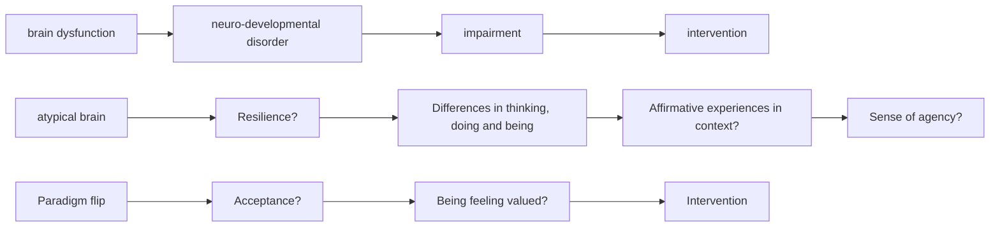

# Editorial: Paradigm ‘flipping’ to reinvigorate translational science: Outlining a neurodevelopmental science framework from a ‘neurodiversity’ perspective

The Journal of Child Psychology & Psychiatry promotes clinical translational science. Translational, in that its ultimate purpose is practical – to promote the well-being of children and young people. Clinical, in the sense that it aims to achieve this by creating interventions that prevent, or treat, psychopathological or neuro-developmental conditions in individuals to reduce the mental distress and suffering they cause. Scientific, because this purpose is fulfilled, and these aims achieved, through a rational process of knowledge discovery – applying the scientific method to improve our understanding of the causes, course and consequences of mental health and neuro-developmental variation.

## Paradigm shifts in translational science: distinguishing empirical and cultural processes.

This approach promises gradual progress through the steady accumulation, and cautious application, of new knowledge acquired. According to Kuhn, such incremental progress is a hallmark of ‘normal science’ (Kuhn, 1962). He argued that this is made possible only by the existence of a set of stable underlying assumptions, presumed not tested, about the phenomena of interest – in our case mental health and neuro-developmental conditions. This, he called a paradigm. Crucially, Kuhn believed that scientific progress is nonlinear, with periods of ‘normal science’ punctuated by periods of crisis, when one paradigm, and the assumptions upon which it rests, are overturned and replaced by an alternative one. Many believe that our field is facing such a period of upheaval today; a situation precipitated by significant challenges to the assumptions on which our clinical translational science paradigm is based. This seems especially to be the case for neuro-developmental conditions and is perhaps best illustrated with reference to autism and ADHD (Sonuga-Barke, 2020).

According to Kuhn, dominant paradigms fall when they lose scientific credibility – when the assumptions on which they rest are no longer reconcilable with emerging research evidence. In this regard the mismatch between the data emerging from our labs and our paradigmatic assumption, that neurodevelopmental conditions are singular and discrete disorders caused by core brain dysfunction that, as a matter of course, create impairment, is becoming increasingly clear (Sonuga-Barke, 2020). This disorder paradigm is also being challenged because it is not delivering clinically – an especially vital aspect of paradigm value in translational clinical science. From this point of view, our disorder paradigm promotes the targeting of brain dysfunction to fix neuro-psychological deficits, reduce symptoms/disorder and alleviate impairment. However, in the ADHD field, at least, novel science-driven

approaches, (i.e. interventions developed based specifically on ADHD-science) targeting putative disorderrelated brain processes have, to date, been unsuccessful in this regard (e.g. Westwood et al., 2023).

Although not considered in Kuhn’s paradigm-shift formulation, perhaps the most fundamental challenge to our current disorder paradigm is cultural rather than empirical – coming as it does from a

social movement, loosely organised under the banner of neurodiversity, a movement motivated primarily by the pursuit of social justice rather than the drive for scientific progress or clinical innovation. The neurodiversity perspective, challenges, head-on, the disorder concept and the medicalisation of certain forms of divergent thought and action it implies. It does this because, eschewing the positive clinical motives with which it was formulated or any benefits it has delivered in terms of improved care, it sees the disorder concept as an instrument through which oppressive societal norms and expectations are imposed on people with autism, ADHD and other neuro-developmental conditions. This, it is argued undermines dignity, stifles agency and delegitimises personal experience, creating stigma and prejudice (for an interesting discussion of the ideological routes of neurodiversity see Ne’eman & Pellicano, 2022).

But what are the implications of the neurodiversity position, and especially its rejection of the concept of disorder, for models of translational science? Could it spur scientific creativity in our field by providing a new perspective on the nature of neurodevelopmental conditions that lead us to new theories, hypotheses and methods?

The neurodiversity concept reverses this narrative from one that can be seen as presenting neurodivergent people as disordered, a clinical problem or social burden in need of ‘treatment’, to one that accepts, values and indeed celebrates, their different ways of thinking, doing and being, and the potential contribution these make to society (Axbey et al., 2023). Through this, it seeks to empower neurodivergent people while at the same time encouraging social, educational and clinical agencies to challenge their own assumptions and change their practice. Indeed, the focus on self-advocacy and the privileging of the neurodivergent person’s point of view is creating a much more balanced and collaborative approach to research and clinical care (Shaw et al., 2021).

## The neurodiversity concept – disentangling ontological from ideological elements.

But what are the implications of the neurodiversity position, and especially its rejection of the concept of disorder, for models of translational science? Could it spur scientific creativity in our field by providing a new perspective on the nature of neurodevelopmental conditions that lead us to new theories, hypotheses and methods? One might argue that in its purest formulation the neurodiversity concept is essentially, and deeply, ideological, rejecting not just the specific concept of disorder, but rather the entire individualistic therapeutic focus that guides our work as translational scientists. In this way, it both echoes aspects of the anti-psychiatry movement while incorporating the neurodiversity concept into a wider political search for social justice of marginalised groups (Strand, 2017). The main goal becoming to transform stifling cultural norms and re-order unjust societal structures, rather than supporting neurodivergent individuals clinically to function more effectively within those structures. If taken to its logical conclusion such an exclusively ideological interpretation would, in fact, leave clinical translational science, as it relates to neurodivergence, not refreshed but redundant.

However, I do not see the neurodiversity position as the end of neuro-developmental translational research, but rather an exciting opportunity to explore a different sort of science. This is because, crucially for the current analysis, on deeper reflection, one can see that it contains ontological assumptions that are distinguishable from its ideological assertions: That is, assumptions about the nature of neuro-developmental conditions that potentially contain the philosophical seeds of a new scientific paradigm. I would therefore argue that even if you reject its more radical ideological precepts, as people of goodwill may, you can still harness the potential of the alternative ontological assumptions contained in the neurodiversity concept to ‘flip’ the disorder paradigm in a way that reinvigorates our research by allowing us an alternative perspective, leading to new research questions and the testing of novel hypotheses. Could this “new science” be more fruitful empirically and more productive clinically than the one based on the current disorder paradigm? (Sonuga-Barke & Thapar, 2021).

## Neurodiversity: an alternative paradigm for translational science?

Figure 1 represents my interpretation of how a ‘flip’ from a disorder to a divergence paradigm changes our core assumptions, translational goals and reframes our scientific focus. First, the notion of disorder categories underpinned by brain dysfunction intrinsically linked to impairment is replaced by that of a divergence in thought and action, manifesting patterns of brain atypicality where their positive or negative impact is determined primarily by the quality of the environment to which individuals are exposed and the nature of the experiences these create. Second, the translational goal is no longer to find ways to target dysfunctional brain or fix associated psychological deficits to reduce symptoms and remove impairment but rather to promote positive environments and affirmative experiences. Adopting this model changes our core scientific imperative: Our research switches from being driven to identify the sources of brain dysfunction that create disorder to identifying which environments promote affirmative experiences and positive outcomes and to study which neurodivergent people benefit from these, and why. Partitioning how variations in individual characteristics and needs determine (social and non-social) environmental advantages, becomes a central focus for research, as do studies of the neuro-psychological and social mediators of the pathways from person-environment alignment to positive outcomes.

Disorder paradigm  

flowchart

Figure 1 Disorder versus neurodiversity paradigms. Disorder paradigm – translational imperative is to develop intervention to target brain dysfunction, reduce symptoms and alleviate impairment. Neurodiversity paradigm – translational imperative is to create interventions that produce neurodivergent affirmative experiences and promote developmental thriving

If according to the neurodiversity paradigm, the value of interventions is no longer to be judged in terms of symptom reduction and deficit fixing, how should they be evaluated? What constitutes a good outcome from this perspective. Here, as in other regards, I believe taking a neurodiversity perspective leads to a fundamental shift in thinking. For instance, adopting a lifespan developmental framework one can think of defining affirmative experiences as those that promote what might be called an ‘arc of personal growth’ (Baker et al., 2023). This could be thought of as made up of a series of interrelated and overlapping phases. First, removing stigma to ensure that individuals feel accepted and valued (both by themselves and by others). Second, adjusting settings and creating opportunities that allow unrecognised strengths and abilities to emerge, be acknowledged and nurtured. Third, building on these, to strengthen skills to promote agency and build self-efficacy and confidence. Finally, introducing carefully staged and scaffolded challenges to promote resilience. The ultimate ambition of this sort of wholistic approach being to help neurodivergent people to thrive. Existing pharma and non-pharma interventions can of course still play a valuable role in promoting this arc of growth, but from the new perspective, they should be evaluated ultimately against their ability to promote development within the arc of growth rather than to reduce symptoms, fix neuro-psychological deficits or even just reduce short-term impairment.

## Promoting participatory approaches to harness both neurodiversity and neuro-affinity to promote scientific progress

A ‘flip’ to a neurodiversity from a disorder paradigm would not only change what we study and why, but also how we study. Most importantly it pushes us beyond current participatory approaches. Inviting neurodivergent individuals to take on a fuller role in research – moving from external advisor to coinvestigator where, as part of the research team, they can contribute more fully to the research process, shaping its purpose and direction, its methodological implementation and contributing to its dissemination and impact. Such a model is currently being implemented in Regulating Emotions – Strengthening Adolescent Resilience (RE-STAR), a study of pathways to depression in autistic youth and those with ADHD (Sonuga-Barke et al., 2023). What makes the RE-STAR research participation model tick is the Youth Researcher Panel (Y-RP). This is a group of autistic young people and those with ADHD (and both) who, with scaffolded support and carefully scheduled activities, implemented within a well-developed duty-ofcare framework, sit at the heart of the research team. This has allowed RE-STAR to draw on their experiences and aptitudes to enrich the research process through contributions to hypothesis generation, method development, data collection, analysis, write up and dissemination.

The beneficial impact that the Y-RPers on RE-STAR pushes us to think more deeply about the role of neurodivergent scientists in the study of neuro-developmental variation more generally – an under-appreciated and -researched issue. Why would we suspect that the inclusion of neurodivergent scientists would add value? I can think of two hypotheses. First, through the ‘neuro-affinity’ that comes from the shared experiences (psychological and sociological; positive and negative) they have had with their neurodivergent participants. This could allow new insights to improve theory and method and increase the applicability and effectiveness of emergent interventions. Second, through the individual intellectual and motivational attributes that neurodivergent people can bring to collective scientific endeavour. In different individuals, these could include, for instance, a tendency to non-conformity, intellectual creativity, energy and speed of thought, or, detail-driven, focused and systematic thinking. This seems an area ripe for further study.

In summary, leaving aside ideological considerations, the neurodiversity perspective offers an interesting alternative paradigm for translational studies of neuro-developmental variation. It encourages a refocusing of therapeutic purpose and by doing this promotes an exciting new research agenda. It also supports an extension of existing participatory models to enrich the research process. It highlights the potential value of including neurodivergent people in science. Only future research will show us whether this alternative paradigm can provide a basis for a more informative and clinically productive science.

Edmund J. S. Sonuga-Barke King’s College London, London, UK E-mail: edmund.sonuga-barke@kcl.ac.uk

## Acknowledgements

The author would like to acknowledge the fascinating discussions about neurodiversity he has had with colleagues in the RE-STAR team, Sylvan Baker, Susie Chandler, Steve Lukito, Myrofora Kakoulidou and Georgia Pavlopoulou – these have influenced the ideas in this editorial in incalculable ways. This editorial represents independent research part funded by the NIHR Maudsley Biomedical Research Centre at South London and Maudsley NHS Foundation Trust and King’s College London. The views expressed are those of the author and not necessarily those of the NIHR or the Department of Health and Social Care.

## References

Axbey, H., Beckmann, N., Fletcher-Watson, S., Tullo, A., & Crompton, C.J. (2023). Innovation through neurodiversity: Diversity is beneficial. Autism.  
Baker, S., Chandler, S., Sonuga-Barke, E.J.S., & the RE-STAR Team. (2023). Salvesen lecture: The neurodiversity concept: Foundation for a new science of neurodevelopment. Edinburgh. https://www.youtube.com/watch?v=Q6i1VBZWRc0  
Kuhn, T. (1962). The structure of scientific revolutions. Princeton, NJ: Princeton University Press.  
Ne’eman, A., & Pellicano, E. (2022). Neurodiversity as politics. Human Development, 66, 149–157.  
Shaw, S., McCowan, S., Doherty, M., Grosjean, B., & Kinnear, M. (2021). The neurodiversity concept viewed through an autistic lens. The Lancet Psychiatry, 8, 654–655.  
Sonuga-Barke, E. (2020). “People get ready”: Is mental disorder diagnostics ripe for Kuhnian revolution. Journal of Child Psychology & Psychiatry, 61, 1–3.  
Sonuga-Barke, E., & Thapar, A. (2021). The neurodiversity concept: Is it helpful for clinicians and scientists? The Lancet Psychiatry, 8, 559–561.  
Sonuga-Barke, E.J.S., Chandler, S., Lukito, S., Kakoulidou, M., Moore, G., Cooper, N., . . . Pavlopoulou G on behalf of the RE-STAR team. (2023). How can we move beyond current patient and public involvement models to enrich translational science? A framework for integrating autistic people and those with ADHD into research practice. British Journal of Psychiatry.  
Strand, L.R. (2017). Charting relations between intersectionality theory and the neurodiversity paradigm. Disability Studies Quarterly, 37, 2.  
Westwood, S.J., Parlatini, V., Rubia, K., Cortese, S., & Sonuga-Barke, E.J.S. (2023). Computerized cognitive training in attention-deficit/hyperactivity disorder (ADHD): A meta-analysis of randomized controlled trials with blinded and objective outcomes. Molecular Psychiatry, 28, 1402–1414.

Accepted for publication: 15 August 2023